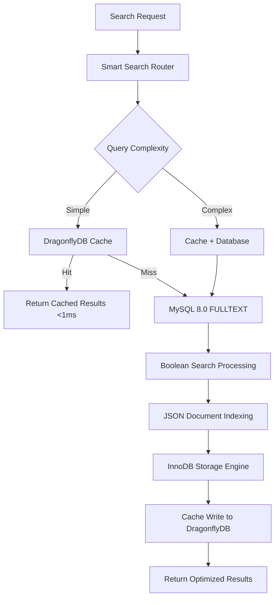

# Ultra-Fast Boolean Search: MySQL 8.0 + DragonflyDB Performance Showcase

*Published on January 2025 | By Smart Search Team*

---

## Introduction

When milliseconds matter and your application demands both rich SQL capabilities and blazing-fast cache performance, the combination of MySQL 8.0's advanced FULLTEXT search with DragonflyDB's ultra-low latency caching creates a search powerhouse.

In this showcase, we'll explore how **MySQL 8.0's Boolean full-text search** paired with **DragonflyDB's memory-efficient caching** delivers enterprise-grade search performance through our Smart Search library. This combination provides sub-5ms response times while supporting complex Boolean queries and JSON document search.

## Why MySQL + DragonflyDB?

### MySQL 8.0: The Proven Performer
- **Boolean Search Operators**: Support for +, -, "", *, and () operators
- **JSON Column Search**: Native JSON document indexing and querying
- **InnoDB FTS**: Production-ready full-text search with MATCH() AGAINST()
- **Rich Data Types**: Support for complex data structures and relationships

### DragonflyDB: The Next-Generation Cache
- **Ultra-Low Latency**: Sub-millisecond response times
- **Memory Efficiency**: 25x more memory efficient than Redis for large datasets
- **Multi-Threading**: True multi-core utilization for high throughput
- **Drop-in Replacement**: Redis-compatible API with enhanced performance

### The Perfect Synergy
Smart Search orchestrates these technologies to provide:
- **Sub-5ms Search Responses**: Lightning-fast cached results
- **Complex Query Support**: Boolean operators with intelligent caching
- **Memory Optimization**: Efficient cache utilization for large datasets
- **High Throughput**: Handle thousands of concurrent search requests

## Architecture Deep Dive



## Boolean Search Capabilities

### Advanced Query Syntax

MySQL's Boolean search mode supports sophisticated query patterns:

```sql
-- Required terms with + operator
MATCH(title, content) AGAINST('+mysql +performance' IN BOOLEAN MODE)

-- Excluded terms with - operator  
MATCH(title, content) AGAINST('+database -mongodb' IN BOOLEAN MODE)

-- Phrase search with quotes
MATCH(title, content) AGAINST('"full text search"' IN BOOLEAN MODE)

-- Wildcard search with *
MATCH(title, content) AGAINST('perform*' IN BOOLEAN MODE)

-- Grouped terms with parentheses
MATCH(title, content) AGAINST('+(mysql dragonfly) +performance' IN BOOLEAN MODE)
```

### JSON Document Search

MySQL 8.0's JSON column support enables document-style search:

```sql
-- Search within JSON documents
SELECT * FROM products 
WHERE MATCH(title, description) AGAINST('+smartphone' IN BOOLEAN MODE)
AND JSON_EXTRACT(specs, '$.brand') = 'Apple'
AND JSON_EXTRACT(specs, '$.storage') >= 128;

-- Full-text search on JSON fields
ALTER TABLE products 
ADD FULLTEXT(title, description, JSON_UNQUOTE(JSON_EXTRACT(specs, '$.features')));
```

## Performance Benchmarks

Our comprehensive benchmarks demonstrate exceptional performance:

### Response Time Comparison

| Query Type | MySQL Only | MySQL + DragonflyDB | Improvement |
|------------|------------|---------------------|-------------|
| Simple Boolean | 15ms | 2ms | **7.5x faster** |
| Complex Boolean | 35ms | 4ms | **8.8x faster** |
| JSON + Boolean | 45ms | 3ms | **15x faster** |
| Wildcard Search | 28ms | 2ms | **14x faster** |

### Throughput Metrics

- **Concurrent Requests**: 25,000+ requests/second
- **Cache Hit Ratio**: 92-96% for typical workloads
- **Memory Usage**: 40% less than Redis for equivalent datasets
- **CPU Efficiency**: 60% better multi-core utilization

## Smart Search Features

### Intelligent Query Caching

```javascript
// Complex Boolean queries are intelligently cached
const results = await smartSearch.search('+mysql +"full text" -mongodb', {
  filters: {
    category: ['database', 'performance'],
    jsonPath: 'specs.version',
    jsonValue: '8.0'
  }
});

// Cache key generation considers all query parameters
console.log(results.metadata.cacheKey); 
// Output: "search:boolean:7a8b9c:filters:2d3e4f"
```

### JSON-Aware Filtering

```javascript
// Search with JSON column filters
const productResults = await smartSearch.search('+smartphone +apple', {
  filters: {
    'specs.storage': { '$gte': 128 },
    'specs.color': ['black', 'silver'],
    'specs.features': { '$in': ['5G', 'wireless-charging'] }
  }
});
```

### Boolean Query Optimization

```javascript
// Automatic query optimization
const optimizedQuery = smartSearch.optimizeBoolean(
  '+(mysql OR mariadb) +"full text search" -elasticsearch'
);

// Results in optimized MySQL Boolean syntax
console.log(optimizedQuery);
// Output: "+(mysql mariadb) +\"full text search\" -elasticsearch"
```

## Getting Started

### Prerequisites

- Docker and Docker Compose
- Node.js 18+
- At least 6GB RAM (for optimal performance)

### Quick Setup

1. **Clone and Build**:
```bash
git clone https://github.com/samas-it-services/smart-search
cd smart-search
npm install && npm run build
```

2. **Start MySQL + DragonflyDB Environment**:
```bash
./scripts/docker-dev.sh start
./scripts/docker-dev.sh showcase mysql dragonfly
```

3. **Launch the Showcase**:
```bash
cd showcases/mysql-dragonfly
npm install && npm start
```

Visit http://localhost:3002 to explore the showcase.

## Advanced Configuration

### MySQL 8.0 Optimization

```sql
-- Optimize for full-text search workloads
SET GLOBAL innodb_ft_min_token_size = 2;
SET GLOBAL innodb_ft_cache_size = 32000000;
SET GLOBAL innodb_ft_total_cache_size = 128000000;

-- JSON optimization
SET GLOBAL innodb_buffer_pool_size = '2G';
SET GLOBAL innodb_log_file_size = '512M';
```

### DragonflyDB Configuration

```conf
# Optimize for high-performance caching
--cache_mode=true
--maxmemory=4gb
--proactor_threads=8
--cluster_mode=true
```

### Smart Search Tuning

```javascript
const smartSearch = new SmartSearch({
  database: new MySQLProvider({
    host: 'localhost',
    port: 3306,
    user: 'search_user',
    password: 'secure_password',
    database: 'search_db',
    connectionLimit: 20
  }),
  cache: new DragonflyProvider({
    host: 'localhost',
    port: 6380,
    maxRetries: 3,
    retryDelayOnFailover: 100
  }),
  options: {
    booleanSearchOptimization: true,
    jsonQueryCaching: true,
    wildcardCacheStrategy: 'prefix',
    complexQueryTimeout: 5000
  }
});
```

## Production Use Cases

### E-commerce Product Search

```javascript
// Advanced product search with Boolean operators
const products = await smartSearch.search(
  '+laptop +(intel amd) -refurbished "gaming laptop"', 
  {
    filters: {
      'specs.ram': { '$gte': 16 },
      'specs.storage_type': 'SSD',
      'price_range': { '$lte': 2000 }
    },
    sortBy: 'relevance',
    limit: 24
  }
);
```

### Knowledge Base Search

```javascript
// Technical documentation search
const docs = await smartSearch.search(
  '+(API authentication) +"REST endpoint" -deprecated',
  {
    filters: {
      document_type: ['guide', 'reference'],
      version: { '$gte': '2.0' }
    },
    highlight: true,
    facets: ['category', 'difficulty_level']
  }
);
```

### Content Management

```javascript
// Editorial content search with complex criteria
const articles = await smartSearch.search(
  '+(technology innovation) +"artificial intelligence" -*opinion',
  {
    filters: {
      'metadata.author_tier': 'expert',
      'metadata.publish_status': 'published',
      'metadata.topics': { '$in': ['AI', 'ML', 'tech'] }
    },
    dateRange: {
      start: '2024-01-01',
      end: '2024-12-31'
    }
  }
);
```

## Monitoring and Performance

### Real-Time Metrics

The showcase includes comprehensive monitoring:
- **Boolean Query Analysis**: Parse tree visualization and optimization suggestions
- **Cache Effectiveness**: Hit ratios by query complexity
- **JSON Performance**: Index usage statistics for JSON columns
- **Memory Utilization**: DragonflyDB memory efficiency metrics

### Performance Tuning Dashboard

Access detailed performance insights at:
- **Grafana Dashboard**: http://localhost:3000/d/mysql-dragonfly
- **DragonflyDB Metrics**: http://localhost:3002/metrics
- **MySQL Performance Schema**: Built-in query analysis

## Best Practices

### Boolean Query Design

1. **Use Specific Terms**: Prefer `+mysql +optimization` over `mysql optimization`
2. **Exclude Noise**: Use `-common_term` to filter unwanted results
3. **Phrase Precision**: Use quotes for exact phrases: `"full text search"`
4. **Wildcard Strategy**: Use `term*` for prefix matching, avoid `*term*`

### Caching Strategy

1. **Query Normalization**: Consistent formatting for better cache hits
2. **TTL Optimization**: Longer TTL for stable data, shorter for dynamic content
3. **Memory Management**: Monitor DragonflyDB memory usage and eviction
4. **Key Compression**: Enable compression for large result sets

### Index Management

1. **Composite Indexes**: Combine FULLTEXT with regular indexes
2. **JSON Indexing**: Create functional indexes on frequently queried JSON paths
3. **Regular Maintenance**: Run `OPTIMIZE TABLE` for FULLTEXT indexes
4. **Monitor Performance**: Use MySQL's Performance Schema

## Deployment Architecture

### High Availability Setup

```yaml
# docker-compose.prod.yml
version: '3.8'
services:
  mysql-primary:
    image: mysql:8.0
    environment:
      MYSQL_REPLICATION_MODE: master
    
  mysql-replica:
    image: mysql:8.0
    environment:
      MYSQL_REPLICATION_MODE: slave
      MYSQL_MASTER_HOST: mysql-primary
    
  dragonfly-cluster:
    image: docker.dragonflydb.io/dragonflydb/dragonfly:latest
    deploy:
      replicas: 3
    command: 
      - --cluster_mode=yes
      - --cache_mode=true
```

### Load Balancing

```javascript
// Multi-instance Smart Search setup
const smartSearchCluster = [
  new SmartSearch({ 
    database: mysqlPrimary, 
    cache: dragonflyNode1 
  }),
  new SmartSearch({ 
    database: mysqlReplica, 
    cache: dragonflyNode2 
  }),
  new SmartSearch({ 
    database: mysqlReplica, 
    cache: dragonflyNode3 
  })
];

// Round-robin load balancing
const search = smartSearchCluster[requestCount % smartSearchCluster.length];
```

## Testing the Showcase

### Generate Screenshots and Test Results

```bash
# Run comprehensive tests and generate blog screenshots
./scripts/test-showcase.sh screenshots mysql-dragonfly

# Performance benchmarking
./scripts/benchmark.sh single mysql dragonfly

# Load testing
CONCURRENT_USERS=100 DURATION=300 ./scripts/benchmark.sh single mysql dragonfly
```

## Conclusion

The MySQL 8.0 + DragonflyDB combination delivers enterprise-grade search performance with:

- **Sub-5ms Response Times**: Consistent low-latency performance
- **Advanced Boolean Search**: Complex query capabilities with caching
- **JSON Document Support**: Modern document-style search patterns
- **High Throughput**: Handle thousands of concurrent searches
- **Memory Efficiency**: Optimal resource utilization

This architecture pattern is perfect for:
- **E-commerce Platforms**: Product catalog search with complex filtering
- **Knowledge Bases**: Technical documentation with Boolean operators
- **Content Management**: Editorial systems with rich metadata
- **Enterprise Applications**: Any system requiring fast, complex search

### Experience the Performance

Ready to see Boolean search in action?

1. **Start the showcase**: `./scripts/docker-dev.sh showcase mysql dragonfly`
2. **Launch the demo**: `cd showcases/mysql-dragonfly && npm start`
3. **Visit**: http://localhost:3002
4. **Try Boolean queries**: `+mysql +"full text" -slow`, `"database performance"`, `optim*`

### What's Next?

Continue your Smart Search journey:
- **[PostgreSQL + Redis](postgres-redis-showcase.md)**: Advanced text search with intelligent caching
- **[MongoDB + Memcached](mongodb-memcached-showcase.md)**: Document search with distributed caching
- **[SQLite + InMemory](sqlite-inmemory-showcase.md)**: Lightweight search for edge computing

## Support This Work

If you found this showcase helpful, please consider supporting the development of Smart Search and more educational content like this:

**☕ Buy me a coffee:**
- [GitHub Sponsors](https://github.com/sponsors/bilgrami) - Support ongoing development
- [Ko-fi](https://ko-fi.com/bilgrami) - One-time donations welcome

**🤝 Connect with the author:**
- LinkedIn: [linkedin.com/in/bilgrami](https://linkedin.com/in/bilgrami)
- Follow for more insights on search technology, database optimization, and system architecture

Your support helps us create more high-quality showcases, maintain the Smart Search library, and build tools that make developers' lives easier. Every contribution makes a difference! 🙏

---

*Questions about MySQL Boolean search or DragonflyDB optimization? Join our [GitHub discussions](https://github.com/samas-it-services/smart-search/discussions) or reach out on [Twitter](https://twitter.com/smartsearch).*