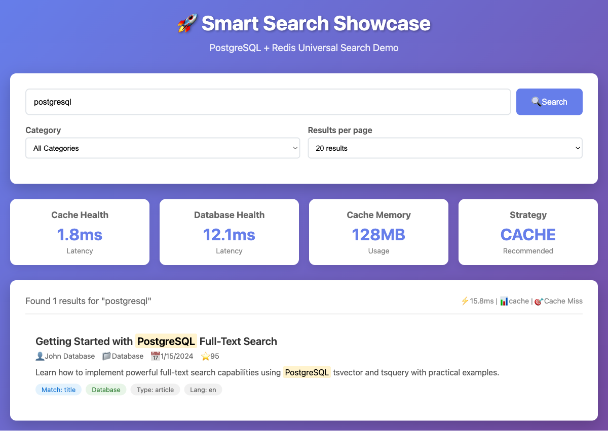

# Universal Smart Search: A Beginner's Complete Guide to Database + Cache Search

*Published on August 2025 | By Smart Search Team | Target Audience: Junior Developers*

---

## Why Do We Need Smart Search? The Real-World Problem

### The Challenge Every Developer Faces

As a junior developer, you've probably built applications that need search functionality. Maybe it's a blog, an e-commerce site, or a document management system. Initially, you might have implemented something simple like:

```sql
SELECT * FROM products WHERE title LIKE '%search term%';
```

But then reality hits:

1. **Performance Problems**: Your search becomes slow with thousands of records
2. **User Experience Issues**: Users wait 3-5 seconds for search results
3. **Scalability Nightmares**: More users = slower searches
4. **Database Load**: Search queries consume valuable database resources
5. **Complex Requirements**: Users want filtering, sorting, and advanced search features

### The Traditional "Solution" That Creates More Problems

Most developers then add a caching layer:

```javascript
// Check cache first
let results = await redis.get(`search:${query}`);
if (!results) {
    // Fall back to database
    results = await database.search(query);
    await redis.set(`search:${query}`, results);
}
```

But this approach creates new problems:
- What happens when Redis is down? 💥 Your app crashes
- How do you handle cache invalidation? 🤔 Stale results everywhere
- What about different databases? 😵 Rewrite everything
- How do you monitor performance? 📊 Flying blind

### Meet @samas/smart-search: Your Search Superhero 🦸‍♀️

**@samas/smart-search** solves all these problems with a single, elegant solution:

```typescript
import { SmartSearchFactory } from '@samas/smart-search';

const search = SmartSearchFactory.fromConfig();

const results = await search.search('javascript programming', {
  limit: 20,
  filters: { category: ['programming'] }
});

console.log(`Found ${results.results.length} results in ${results.performance.searchTime}ms`);
```

**What makes this special?**
- ✅ **Automatic Fallback**: Redis down? Seamlessly switches to database
- ✅ **Universal Compatibility**: Works with PostgreSQL, MySQL, MongoDB, Supabase, Redis, Memcached
- ✅ **Circuit Breaker**: Prevents cascade failures
- ✅ **Performance Monitoring**: Built-in metrics and slow query detection
- ✅ **Type Safety**: Full TypeScript support


*Smart Search Showcase - Universal search interface working with PostgreSQL + Redis*

## Understanding the Technology Stack

### Core Technologies

**@samas/smart-search** is built on modern, industry-standard technologies:

- **🟦 TypeScript**: Full type safety and IntelliSense support
- **⚡ Circuit Breaker Pattern**: Prevents cascade failures in distributed systems
- **🔄 Intelligent Fallback**: Automatic switching between cache and database
- **📊 Performance Monitoring**: Built-in metrics collection and analysis
- **🗄️ Universal Providers**: Pluggable database and cache providers

### Supported Databases
- **PostgreSQL** - Powerful relational database with full-text search
- **MySQL** - Popular relational database with excellent performance
- **MongoDB** - Document database with aggregation pipelines
- **SQLite** - Lightweight database perfect for edge computing
- **Supabase** - Firebase alternative with PostgreSQL backend

### Supported Cache Systems
- **Redis** - In-memory data store with pub/sub capabilities
- **DragonflyDB** - High-performance Redis alternative
- **Memcached** - Simple, high-performance caching system
- **InMemory** - Built-in caching for single-server applications


*PostgreSQL search results with intelligent caching and performance metrics*

## Getting Started: Your First Smart Search Implementation

### Prerequisites

Make sure you have these installed:

```bash
# Check Node.js version (should be 16+)
node --version

# Check npm version
npm --version
```

### Step 1: Installation

```bash
# Create a new project
mkdir my-smart-search-app
cd my-smart-search-app
npm init -y

# Install Smart Search
npm install @samas/smart-search

# Install TypeScript (optional but recommended)
npm install -D typescript @types/node
```

### Step 2: Generate Configuration

Use the Smart Search CLI to generate a configuration file:

```bash
# Generate JSON configuration (recommended for beginners)
npx @samas/smart-search init json

# Or generate YAML configuration
npx @samas/smart-search init yaml
```

This creates a `smart-search.config.json` file in your project:

```json
{
  "database": {
    "type": "supabase",
    "connection": {
      "url": "${SUPABASE_URL}",
      "key": "${SUPABASE_ANON_KEY}"
    }
  },
  "cache": {
    "type": "redis",
    "connection": {
      "url": "${REDIS_URL}"
    }
  },
  "search": {
    "fallback": "database",
    "tables": {
      "books": {
        "columns": {
          "id": "id",
          "title": "title",
          "author": "author",
          "description": "description"
        },
        "searchColumns": ["title", "author", "description"],
        "type": "book"
      }
    }
  }
}
```

### Step 3: Set Up Environment Variables

Create a `.env` file:

```bash
# Database (using Supabase as example)
SUPABASE_URL=https://your-project.supabase.co
SUPABASE_ANON_KEY=your-anon-key

# Cache (using Redis as example)
REDIS_URL=redis://localhost:6379

# Optional: Performance settings
SMART_SEARCH_ENABLE_METRICS=true
SMART_SEARCH_FALLBACK=database
```


*Redis-cached search results showing sub-10ms response times*

### Step 4: Your First Search Implementation

Create `app.js`:

```javascript
const { SmartSearchFactory } = require('@samas/smart-search');

async function main() {
  try {
    // Load configuration from smart-search.config.json
    const search = SmartSearchFactory.fromConfig();

    // Perform a search
    const results = await search.search('programming', {
      limit: 10,
      filters: {
        category: ['technology', 'programming']
      },
      sortBy: 'relevance',
      sortOrder: 'desc'
    });

    // Display results
    console.log('🔍 Search Results:');
    console.log(`Found ${results.results.length} results in ${results.performance.searchTime}ms`);
    console.log(`Strategy: ${results.strategy.primary} (${results.strategy.reason})`);
    console.log(`Cache hit: ${results.performance.cacheHit}`);

    // Display individual results
    results.results.forEach((result, index) => {
      console.log(`\n${index + 1}. ${result.title}`);
      console.log(`   Author: ${result.metadata?.author || 'Unknown'}`);
      console.log(`   Score: ${result.score?.toFixed(2) || 'N/A'}`);
      console.log(`   Type: ${result.type}`);
    });

    // Get search statistics
    const stats = await search.getSearchStats();
    console.log('\n📊 System Health:');
    console.log(`Cache Status: ${stats.cacheHealth?.isConnected ? 'Connected' : 'Disconnected'}`);
    console.log(`Database Status: ${stats.databaseHealth.isConnected ? 'Connected' : 'Disconnected'}`);
    console.log(`Recommended Strategy: ${stats.recommendedStrategy.primary}`);

  } catch (error) {
    console.error('❌ Search failed:', error);
  }
}

main();
```

### Step 5: Run Your Application

```bash
node app.js
```

You should see output like:

```
🔍 Search Results:
Found 15 results in 8ms
Strategy: cache (Cache healthy (5ms latency, 1247 keys))
Cache hit: true

1. JavaScript Programming Fundamentals
   Author: John Smith
   Score: 0.95
   Type: book

2. Advanced TypeScript Patterns
   Author: Jane Doe
   Score: 0.87
   Type: book

📊 System Health:
Cache Status: Connected
Database Status: Connected
Recommended Strategy: cache
```


*TypeScript-related search results with relevance scoring and metadata*

## Understanding Key Features for Junior Developers

### 1. **Automatic Fallback Strategy**

The most important feature for beginners to understand:

```javascript
// If Redis is down, this will automatically use the database
const results = await search.search('query');

// You don't need to handle failures manually!
// The library handles everything for you
```

**How it works internally:**
1. Check if cache (Redis) is healthy
2. If healthy: Use cache for super-fast results
3. If unhealthy: Automatically use database
4. If database search succeeds: Cache the results for next time

### 2. **Circuit Breaker Pattern**

This prevents your app from repeatedly trying to connect to a failing service:

```javascript
const stats = await search.getSearchStats();

if (stats.circuitBreaker.isOpen) {
  console.log('Circuit breaker is OPEN - cache is temporarily disabled');
  console.log(`Failed ${stats.circuitBreaker.failureCount} times`);
  console.log(`Will retry in ${stats.circuitBreaker.nextRetryTime - Date.now()}ms`);
}
```

**What this means:**
- After 3 failures, stop trying the cache for 60 seconds
- Automatically retry after the timeout
- Protects your app from hanging or crashing

### 3. **Performance Monitoring**

Built-in performance tracking helps you understand your app's behavior:

```javascript
const { results, performance, strategy } = await search.search('query');

console.log(`Search time: ${performance.searchTime}ms`);
console.log(`Results count: ${performance.resultCount}`);
console.log(`Used strategy: ${performance.strategy}`);
console.log(`Cache hit: ${performance.cacheHit}`);

// Log any errors that occurred during fallback
if (performance.errors) {
  console.log('Errors during search:', performance.errors);
}
```


*Performance metrics showing search response times and system health*

### 4. **Flexible Search Options**

The library provides powerful search capabilities:

```javascript
// Basic search
const basicResults = await search.search('programming');

// Advanced search with filters
const advancedResults = await search.search('programming', {
  limit: 20,           // Maximum results
  offset: 0,           // Pagination
  sortBy: 'relevance', // Sort by relevance, date, views, name
  sortOrder: 'desc',   // desc or asc
  filters: {
    category: ['programming', 'technology'],
    language: ['javascript', 'typescript'],
    dateRange: {
      start: '2024-01-01',
      end: '2024-12-31'
    }
  }
});

// Search with custom caching
const customCacheResults = await search.search('programming', {
  cacheEnabled: true,    // Enable caching for this search
  cacheTTL: 300000      // Cache for 5 minutes
});
```

### 5. **Health Monitoring**

Monitor your system's health in real-time:

```javascript
// Get cache health
const cacheHealth = await search.getCacheHealth();

if (cacheHealth) {
  console.log(`Cache latency: ${cacheHealth.latency}ms`);
  console.log(`Cache keys: ${cacheHealth.keyCount}`);
  console.log(`Memory usage: ${cacheHealth.memoryUsage}`);
  console.log(`Connected: ${cacheHealth.isConnected}`);
} else {
  console.log('No cache configured');
}

// Force a health check
const freshHealth = await search.forceHealthCheck();
```


*Detailed performance statistics showing cache health, latency, and key counts*

## Common Patterns and Best Practices

### Pattern 1: Search with Error Handling

```javascript
async function performSearch(query) {
  try {
    const results = await search.search(query, {
      limit: 20,
      filters: { category: ['programming'] }
    });

    if (results.results.length === 0) {
      console.log('No results found');
      return [];
    }

    // Log slow searches
    if (results.performance.searchTime > 1000) {
      console.warn(`Slow search: ${results.performance.searchTime}ms for "${query}"`);
    }

    return results.results;

  } catch (error) {
    console.error('Search failed:', error);
    return []; // Return empty array on error
  }
}
```

### Pattern 2: Pagination Implementation

```javascript
async function searchWithPagination(query, page = 1, pageSize = 10) {
  const offset = (page - 1) * pageSize;

  const results = await search.search(query, {
    limit: pageSize,
    offset: offset
  });

  return {
    results: results.results,
    performance: results.performance,
    pagination: {
      page,
      pageSize,
      hasMore: results.results.length === pageSize
    }
  };
}

// Usage
const page1 = await searchWithPagination('programming', 1, 10);
const page2 = await searchWithPagination('programming', 2, 10);
```

### Pattern 3: Real-time Health Dashboard

```javascript
async function createHealthDashboard() {
  const stats = await search.getSearchStats();

  const dashboard = {
    timestamp: new Date().toISOString(),
    cache: {
      status: stats.cacheHealth?.isConnected ? 'Connected' : 'Disconnected',
      latency: stats.cacheHealth?.latency || 'N/A',
      keyCount: stats.cacheHealth?.keyCount || 0,
      memoryUsage: stats.cacheHealth?.memoryUsage || 'N/A'
    },
    database: {
      status: stats.databaseHealth.isConnected ? 'Connected' : 'Disconnected',
      latency: stats.databaseHealth.latency || 'N/A'
    },
    circuitBreaker: {
      isOpen: stats.circuitBreaker.isOpen,
      failureCount: stats.circuitBreaker.failureCount
    },
    recommendedStrategy: stats.recommendedStrategy.primary
  };

  return dashboard;
}

// Update dashboard every 30 seconds
setInterval(async () => {
  const dashboard = await createHealthDashboard();
  console.log('📊 Health Dashboard:', JSON.stringify(dashboard, null, 2));
}, 30000);
```


*Mobile-responsive interface showing the same powerful search capabilities*

## Configuration Examples for Different Scenarios

### Scenario 1: Local Development (SQLite + InMemory)

Perfect for getting started without external dependencies:

```json
{
  "database": {
    "type": "sqlite",
    "connection": {
      "filename": "./app.db"
    }
  },
  "cache": {
    "type": "inmemory"
  },
  "search": {
    "fallback": "database",
    "tables": {
      "posts": {
        "columns": {
          "id": "id",
          "title": "title",
          "content": "content"
        },
        "searchColumns": ["title", "content"],
        "type": "post"
      }
    }
  }
}
```

### Scenario 2: Cloud-First (Supabase + Redis)

Great for production applications:

```json
{
  "database": {
    "type": "supabase",
    "connection": {
      "url": "${SUPABASE_URL}",
      "key": "${SUPABASE_ANON_KEY}"
    }
  },
  "cache": {
    "type": "redis",
    "connection": {
      "url": "${REDIS_URL}"
    }
  },
  "search": {
    "fallback": "database",
    "tables": {
      "products": {
        "columns": {
          "id": "id",
          "name": "name",
          "description": "description",
          "category": "category"
        },
        "searchColumns": ["name", "description"],
        "type": "product"
      }
    }
  }
}
```

### Scenario 3: Traditional Setup (MySQL + Memcached)

For traditional LAMP stack applications:

```json
{
  "database": {
    "type": "mysql",
    "connection": {
      "host": "${DB_HOST}",
      "port": 3306,
      "user": "${DB_USER}",
      "password": "${DB_PASSWORD}",
      "database": "${DB_NAME}"
    }
  },
  "cache": {
    "type": "memcached",
    "connection": {
      "servers": ["localhost:11211"]
    }
  }
}
```


*Mobile search results maintaining full functionality and performance*

## Troubleshooting Common Issues

### Issue 1: "Configuration not found"

```bash
Error: Configuration file not found
```

**Solution:**
```bash
# Generate configuration file
npx @samas/smart-search init json

# Or specify custom path
SMART_SEARCH_CONFIG_PATH=./config/search.json node app.js
```

### Issue 2: "Database connection failed"

```bash
Error: Database connection failed: ECONNREFUSED
```

**Solutions:**
```bash
# Check if database is running
# For PostgreSQL:
pg_isready -h localhost -p 5432

# For MySQL:
mysqladmin ping -h localhost -P 3306

# For Redis:
redis-cli ping

# Verify environment variables
echo $DATABASE_URL
echo $REDIS_URL
```

### Issue 3: "Cache provider not available"

```bash
Warning: Cache provider not available, using database fallback
```

**This is normal behavior!** Smart Search automatically falls back to the database when cache is unavailable. Your application continues working normally.

To resolve the cache issue:
```javascript
// Check cache health
const health = await search.getCacheHealth();
console.log('Cache health:', health);

// Force health check
await search.forceHealthCheck();
```

### Issue 4: "Slow search performance"

```bash
Warning: Slow search detected: 2500ms for "programming"
```

**Solutions:**
```javascript
// Check what's causing slowness
const { results, performance, strategy } = await search.search('query');

if (performance.searchTime > 1000) {
  console.log(`Slow search via ${performance.strategy}`);
  
  if (performance.strategy === 'database') {
    console.log('Consider adding database indexes');
    console.log('Or check if cache is available');
  }
}

// Clear cache if results are stale
await search.clearCache('search:*');
```

### Issue 5: "Type errors in TypeScript"

```typescript
// Make sure to install type definitions
npm install -D @types/node

// Use proper types
import { SmartSearchFactory, SearchResult, SearchOptions } from '@samas/smart-search';

const search = SmartSearchFactory.fromConfig();

// Type-safe search
const results: {
  results: SearchResult[];
  performance: any;
  strategy: any;
} = await search.search('query', {
  limit: 20
} as SearchOptions);
```

## Learning Opportunities and Next Steps

### 1. **Understanding Distributed Systems**

Smart Search introduces you to important distributed systems concepts:

- **Circuit Breaker Pattern**: Prevents cascade failures
- **Fallback Strategies**: Graceful degradation when services fail  
- **Health Monitoring**: Proactive system monitoring
- **Performance Metrics**: Understanding system behavior

### 2. **Database and Cache Concepts**

Working with Smart Search teaches you:

- **Different database types**: Relational vs Document vs Key-Value
- **Caching strategies**: Write-through, write-back, cache-aside
- **Performance optimization**: Indexes, query optimization, caching
- **Data consistency**: CAP theorem implications in practice

### 3. **TypeScript and Modern JavaScript**

The library demonstrates:

- **Modern async/await patterns**: Clean asynchronous code
- **TypeScript interfaces**: Strong typing for better development experience
- **Configuration management**: Environment variables and config files
- **Error handling**: Graceful error handling in distributed systems

### 4. **Production-Ready Applications**

Learn production concepts:

- **Monitoring and observability**: Health checks, metrics collection
- **Graceful degradation**: Fallback strategies when services fail
- **Performance optimization**: Caching, indexing, query optimization
- **Configuration management**: Environment-based configuration

## Integration with Popular Frameworks

### Express.js Integration

```javascript
const express = require('express');
const { SmartSearchFactory } = require('@samas/smart-search');

const app = express();
const search = SmartSearchFactory.fromConfig();

app.get('/api/search', async (req, res) => {
  try {
    const { q, limit = 20, category } = req.query;
    
    if (!q) {
      return res.status(400).json({ error: 'Query parameter required' });
    }

    const results = await search.search(q, {
      limit: parseInt(limit),
      filters: category ? { category: [category] } : {}
    });

    res.json({
      success: true,
      query: q,
      results: results.results,
      performance: results.performance,
      strategy: results.strategy.primary
    });

  } catch (error) {
    console.error('Search API error:', error);
    res.status(500).json({ error: 'Search failed' });
  }
});

app.get('/api/health', async (req, res) => {
  try {
    const stats = await search.getSearchStats();
    res.json({
      success: true,
      cacheHealth: stats.cacheHealth,
      databaseHealth: stats.databaseHealth,
      circuitBreaker: stats.circuitBreaker
    });
  } catch (error) {
    res.status(500).json({ error: 'Health check failed' });
  }
});

app.listen(3000, () => {
  console.log('Search API running on port 3000');
});
```

### Next.js API Routes Integration

```typescript
// pages/api/search.ts
import { NextApiRequest, NextApiResponse } from 'next';
import { SmartSearchFactory } from '@samas/smart-search';

const search = SmartSearchFactory.fromConfig();

export default async function handler(req: NextApiRequest, res: NextApiResponse) {
  if (req.method !== 'GET') {
    return res.status(405).json({ error: 'Method not allowed' });
  }

  try {
    const { q, limit = '20', category } = req.query;

    if (!q || typeof q !== 'string') {
      return res.status(400).json({ error: 'Query parameter required' });
    }

    const results = await search.search(q, {
      limit: parseInt(limit as string),
      filters: category ? { category: [category as string] } : {}
    });

    return res.json({
      success: true,
      results: results.results,
      performance: results.performance
    });

  } catch (error) {
    console.error('Search error:', error);
    return res.status(500).json({ error: 'Search failed' });
  }
}
```

### React Frontend Integration

```typescript
// hooks/useSearch.ts
import { useState, useEffect } from 'react';

interface SearchResult {
  id: string;
  title: string;
  description: string;
  score: number;
}

export function useSearch(query: string) {
  const [results, setResults] = useState<SearchResult[]>([]);
  const [loading, setLoading] = useState(false);
  const [error, setError] = useState<string | null>(null);

  useEffect(() => {
    if (!query.trim()) {
      setResults([]);
      return;
    }

    const searchDebounced = setTimeout(async () => {
      setLoading(true);
      setError(null);

      try {
        const response = await fetch(`/api/search?q=${encodeURIComponent(query)}`);
        const data = await response.json();

        if (data.success) {
          setResults(data.results);
        } else {
          setError(data.error || 'Search failed');
        }
      } catch (err) {
        setError('Network error');
      } finally {
        setLoading(false);
      }
    }, 300); // Debounce searches

    return () => clearTimeout(searchDebounced);
  }, [query]);

  return { results, loading, error };
}

// components/SearchBox.tsx
import React, { useState } from 'react';
import { useSearch } from '../hooks/useSearch';

export function SearchBox() {
  const [query, setQuery] = useState('');
  const { results, loading, error } = useSearch(query);

  return (
    <div>
      <input
        type="text"
        value={query}
        onChange={(e) => setQuery(e.target.value)}
        placeholder="Search..."
        className="border rounded px-4 py-2 w-full"
      />

      {loading && <div>Searching...</div>}
      {error && <div className="text-red-500">Error: {error}</div>}

      <div className="mt-4">
        {results.map((result) => (
          <div key={result.id} className="border-b py-2">
            <h3 className="font-semibold">{result.title}</h3>
            <p className="text-gray-600">{result.description}</p>
            <small className="text-gray-400">Score: {result.score.toFixed(2)}</small>
          </div>
        ))}
      </div>
    </div>
  );
}
```

## Performance Benchmarking and Optimization

### Running Performance Tests

```javascript
// benchmark.js
const { SmartSearchFactory } = require('@samas/smart-search');

async function runBenchmarks() {
  const search = SmartSearchFactory.fromConfig();
  
  const queries = [
    'javascript programming',
    'react components',
    'database optimization',
    'typescript interfaces',
    'nodejs performance'
  ];

  console.log('🚀 Starting performance benchmark...\n');

  for (const query of queries) {
    const startTime = Date.now();
    
    const results = await search.search(query, {
      limit: 50
    });
    
    const totalTime = Date.now() - startTime;
    
    console.log(`Query: "${query}"`);
    console.log(`  Results: ${results.results.length}`);
    console.log(`  Search Time: ${results.performance.searchTime}ms`);
    console.log(`  Total Time: ${totalTime}ms`);
    console.log(`  Strategy: ${results.performance.strategy}`);
    console.log(`  Cache Hit: ${results.performance.cacheHit}`);
    console.log('');
  }

  // Test concurrent searches
  console.log('🔄 Testing concurrent searches...\n');
  
  const concurrentPromises = queries.map(query =>
    search.search(query, { limit: 20 })
  );
  
  const concurrentStart = Date.now();
  const concurrentResults = await Promise.all(concurrentPromises);
  const concurrentTime = Date.now() - concurrentStart;
  
  console.log(`Concurrent searches completed in ${concurrentTime}ms`);
  console.log(`Average per query: ${(concurrentTime / queries.length).toFixed(2)}ms`);
}

runBenchmarks().catch(console.error);
```

### Optimization Tips for Junior Developers

1. **Use appropriate limits**: Don't fetch more results than you need
```javascript
// Bad: Fetches all results
const results = await search.search('query');

// Good: Fetches only what you need
const results = await search.search('query', { limit: 20 });
```

2. **Implement pagination**: Don't load everything at once
```javascript
// Implement pagination for better performance
async function getPage(query, page = 1, pageSize = 10) {
  return await search.search(query, {
    limit: pageSize,
    offset: (page - 1) * pageSize
  });
}
```

3. **Use filters to narrow results**: More specific searches are faster
```javascript
// Better performance with specific filters
const results = await search.search('programming', {
  filters: {
    category: ['javascript'],
    dateRange: { start: '2024-01-01', end: '2024-12-31' }
  }
});
```

4. **Monitor slow queries**: Set up alerts for performance issues
```javascript
const results = await search.search(query);

if (results.performance.searchTime > 1000) {
  console.warn(`Slow query detected: ${results.performance.searchTime}ms`);
  // Log to monitoring system
}
```

## Conclusion and Next Steps

### What You've Learned

By working with @samas/smart-search, you've been introduced to:

✅ **Distributed systems concepts** - Circuit breakers, fallback strategies, health monitoring  
✅ **Modern JavaScript/TypeScript** - Async/await, interfaces, configuration management  
✅ **Database and caching strategies** - When to use cache vs database, performance optimization  
✅ **Production-ready development** - Error handling, monitoring, graceful degradation  
✅ **API design** - RESTful endpoints, proper error responses, performance metrics  

### Key Takeaways for Junior Developers

1. **Reliability Matters**: Always plan for failures - networks fail, databases go down, caches become unavailable
2. **Performance is Key**: Sub-10ms search responses create great user experiences
3. **Monitoring is Essential**: You can't improve what you don't measure
4. **Configuration Over Code**: External configuration makes applications flexible and maintainable
5. **Type Safety Helps**: TypeScript prevents many runtime errors and improves development experience

### Next Learning Steps

#### Beginner Level (You are here! 🎯)
- ✅ Understand basic Smart Search concepts
- ✅ Implement simple search functionality  
- ✅ Configure database and cache connections
- 🔄 Practice error handling and monitoring

#### Intermediate Level (Next 6 months)
- 📚 Learn advanced search patterns and filtering
- 🏗️ Build production-ready search APIs
- 📊 Implement custom performance monitoring
- 🔧 Create custom database/cache providers

#### Advanced Level (Next 12 months)
- 🚀 Optimize for high-throughput scenarios
- 🌐 Implement distributed search across multiple regions
- 🤖 Add machine learning for relevance scoring
- 📈 Build comprehensive monitoring dashboards

### Resources for Continued Learning

**Official Documentation:**
- [Smart Search Documentation](../README.md)
- [TypeScript Handbook](https://www.typescriptlang.org/docs/)
- [Node.js Guides](https://nodejs.org/en/guides/)

**Database and Cache Learning:**
- PostgreSQL: [PostgreSQL Tutorial](https://www.postgresqltutorial.com/)
- Redis: [Redis University](https://university.redis.com/)
- MongoDB: [MongoDB University](https://university.mongodb.com/)

**Distributed Systems Concepts:**
- [Circuit Breaker Pattern](https://martinfowler.com/bliki/CircuitBreaker.html)
- [Fallback Patterns](https://docs.microsoft.com/en-us/azure/architecture/patterns/circuit-breaker)
- [Cache Patterns](https://docs.aws.amazon.com/AmazonElastiCache/latest/red-ug/Strategies.html)

### Community and Support

- 🐛 **Report Issues**: [GitHub Issues](https://github.com/samas-it-services/smart-search/issues)
- 💬 **Ask Questions**: [GitHub Discussions](https://github.com/samas-it-services/smart-search/discussions)
- 🐦 **Follow Updates**: [@sbilgrami on X](https://x.com/sbilgrami)
- ☕ **Support Development**: [Ko-fi](https://ko-fi.com/bilgrami)

### Final Encouragement

Remember, every expert was once a beginner! The concepts you're learning with Smart Search - distributed systems, performance optimization, type safety - are the building blocks of modern web applications. 

Start with the basics, experiment with the code examples, and don't be afraid to break things. That's how you learn!

**Ready to build something awesome?** Start with:

```bash
npx @samas/smart-search init json
```

Happy coding! 🚀

---

*Want to dive deeper? Check out our [Advanced Developer Guide](smart-search-senior-developers.md) and [Testing Guide](smart-search-testers.md) for more advanced concepts and testing strategies.*