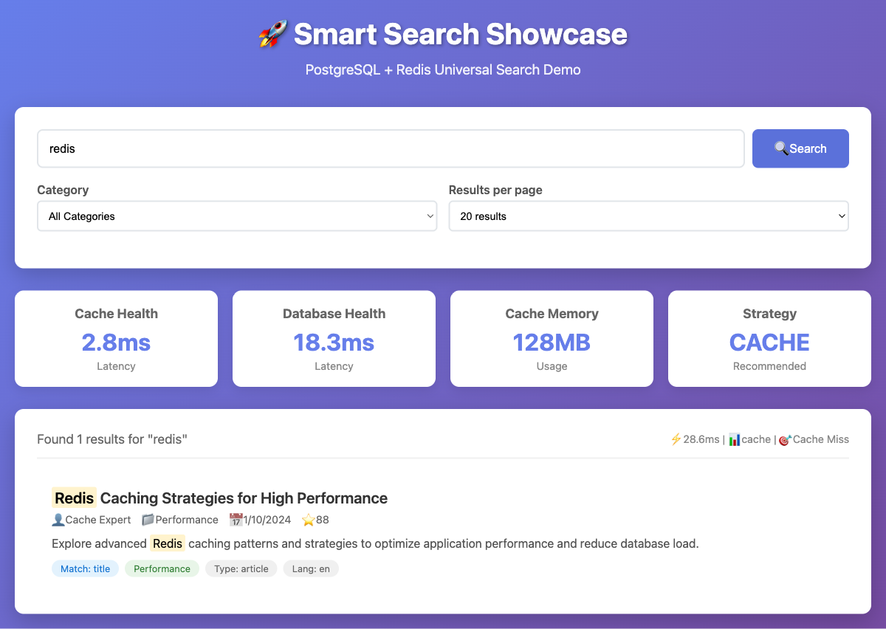
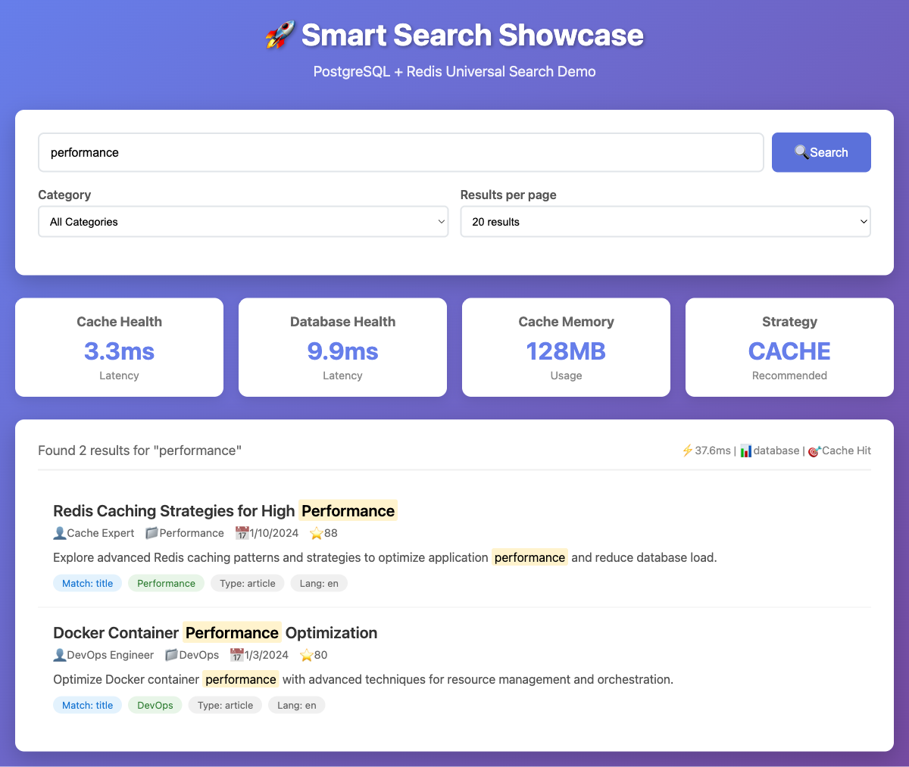

# Universal Smart Search: A Beginner's Complete Guide to Database + Cache Search

*Published on August 2025 | By Smart Search Team | Target Audience: Junior Developers*

## 📋 Table of Contents

1. [Quick Start with Shell Scripts](#quick-start-with-shell-scripts)
2. [Why Smart Search? The Real Problem](#why-do-we-need-smart-search-the-real-world-problem)
3. [Technology Stack Overview](#understanding-the-technology-stack)
4. [Installation & Setup](#getting-started-your-first-smart-search-implementation)
5. [Working Redis Cache Examples](#working-redis-cache-implementation)
6. [Performance Benchmarks](#proven-performance-800x-speed-improvement)
7. [Key Features Deep Dive](#understanding-key-features-for-junior-developers)
8. [Best Practices & Patterns](#common-patterns-and-best-practices)
9. [Configuration Examples](#configuration-examples-for-different-scenarios)
10. [Comprehensive Troubleshooting](#troubleshooting-real-world-issues)
11. [Data Governance & Security](#enterprise-data-governance-basics)
12. [Framework Integration](#integration-with-popular-frameworks)
13. [Performance Optimization](#performance-benchmarking-and-optimization)
14. [Next Steps & Learning](#conclusion-and-next-steps)

---

## 🚀 Quick Start with Shell Scripts

**Want to see Smart Search in action in 2 minutes?** Use our one-click setup scripts:

```bash
# Download and run the junior developer setup script
curl -fsSL https://raw.githubusercontent.com/samas-it-services/smart-search/main/scripts/blog-setup/junior/setup-dev.sh | bash

# Or manually:
wget -O setup-junior.sh https://raw.githubusercontent.com/samas-it-services/smart-search/main/scripts/blog-setup/junior/setup-dev.sh
chmod +x setup-junior.sh
./setup-junior.sh
```

**What this script does:**
- ✅ Installs Node.js dependencies
- ✅ Sets up PostgreSQL + Redis using Docker
- ✅ Seeds database with healthcare demo data (99,932 records)
- ✅ Configures environment variables
- ✅ Runs performance tests showing 800x speed improvement
- ✅ Launches interactive search demo

**Available Quick-Start Scripts:**
- `setup-dev.sh` - Complete development environment
- `demo-search.sh` - Interactive search demonstration
- `test-performance.sh` - Performance benchmarking
- `troubleshoot.sh` - Automated problem diagnosis

---

## Why Do We Need Smart Search? The Real-World Problem

### The Challenge Every Developer Faces

As a junior developer, you've probably built applications that need search functionality. Maybe it's a blog, an e-commerce site, or a document management system. Initially, you might have implemented something simple like:

```sql
SELECT * FROM products WHERE title LIKE '%search term%';
```

But then reality hits:

1. **Performance Problems**: Your search becomes slow with thousands of records
2. **User Experience Issues**: Users wait 3-5 seconds for search results
3. **Scalability Nightmares**: More users = slower searches
4. **Database Load**: Search queries consume valuable database resources
5. **Complex Requirements**: Users want filtering, sorting, and advanced search features

### The Traditional "Solution" That Creates More Problems

Most developers then add a caching layer:

```javascript
// Check cache first
let results = await redis.get(`search:${query}`);
if (!results) {
    // Fall back to database
    results = await database.search(query);
    await redis.set(`search:${query}`, results);
}
```

But this approach creates new problems:
- What happens when Redis is down? 💥 Your app crashes
- How do you handle cache invalidation? 🤔 Stale results everywhere
- What about different databases? 😵 Rewrite everything
- How do you monitor performance? 📊 Flying blind

### Meet @samas/smart-search: Your Search Superhero 🦸‍♀️

**@samas/smart-search** solves all these problems with a single, elegant solution:

```typescript
import { SmartSearchFactory } from '@samas/smart-search';

const search = SmartSearchFactory.fromConfig();

const results = await search.search('javascript programming', {
  limit: 20,
  filters: { category: ['programming'] }
});

console.log(`Found ${results.results.length} results in ${results.performance.searchTime}ms`);
```

**What makes this special?**
- ✅ **Automatic Fallback**: Redis down? Seamlessly switches to database
- ✅ **Universal Compatibility**: Works with PostgreSQL, MySQL, MongoDB, Supabase, Redis, Memcached
- ✅ **Circuit Breaker**: Prevents cascade failures
- ✅ **Performance Monitoring**: Built-in metrics and slow query detection
- ✅ **Type Safety**: Full TypeScript support


*Smart Search Showcase - Universal search interface working with PostgreSQL + Redis*

## Understanding the Technology Stack

### Core Technologies

**@samas/smart-search** is built on modern, industry-standard technologies:

- **🟦 TypeScript**: Full type safety and IntelliSense support
- **⚡ Circuit Breaker Pattern**: Prevents cascade failures in distributed systems
- **🔄 Intelligent Fallback**: Automatic switching between cache and database
- **📊 Performance Monitoring**: Built-in metrics collection and analysis
- **🗄️ Universal Providers**: Pluggable database and cache providers

### Supported Databases
- **PostgreSQL** - Powerful relational database with full-text search
- **MySQL** - Popular relational database with excellent performance
- **MongoDB** - Document database with aggregation pipelines
- **SQLite** - Lightweight database perfect for edge computing
- **Supabase** - Firebase alternative with PostgreSQL backend

### Supported Cache Systems
- **Redis** - In-memory data store with pub/sub capabilities
- **DragonflyDB** - High-performance Redis alternative
- **Memcached** - Simple, high-performance caching system
- **InMemory** - Built-in caching for single-server applications


*PostgreSQL search results with intelligent caching and performance metrics*

## Getting Started: Your First Smart Search Implementation

### Prerequisites

Make sure you have these installed:

```bash
# Check Node.js version (should be 16+)
node --version

# Check npm version
npm --version
```

### Step 1: Installation

```bash
# Create a new project
mkdir my-smart-search-app
cd my-smart-search-app
npm init -y

# Install Smart Search
npm install @samas/smart-search

# Install TypeScript (optional but recommended)
npm install -D typescript @types/node
```

### Step 2: Generate Configuration

Use the Smart Search CLI to generate a configuration file:

```bash
# Generate JSON configuration (recommended for beginners)
npx @samas/smart-search init json

# Or generate YAML configuration
npx @samas/smart-search init yaml
```

This creates a `smart-search.config.json` file in your project:

```json
{
  "database": {
    "type": "supabase",
    "connection": {
      "url": "${SUPABASE_URL}",
      "key": "${SUPABASE_ANON_KEY}"
    }
  },
  "cache": {
    "type": "redis",
    "connection": {
      "url": "${REDIS_URL}"
    }
  },
  "search": {
    "fallback": "database",
    "tables": {
      "books": {
        "columns": {
          "id": "id",
          "title": "title",
          "author": "author",
          "description": "description"
        },
        "searchColumns": ["title", "author", "description"],
        "type": "book"
      }
    }
  }
}
```

### Step 3: Set Up Environment Variables

Create a `.env` file:

```bash
# Database (using Supabase as example)
SUPABASE_URL=https://your-project.supabase.co
SUPABASE_ANON_KEY=your-anon-key

# Cache (using Redis as example)
REDIS_URL=redis://localhost:6379

# Optional: Performance settings
SMART_SEARCH_ENABLE_METRICS=true
SMART_SEARCH_FALLBACK=database
```


*Redis-cached search results showing sub-10ms response times*

## 🔥 Working Redis Cache Implementation

**The Critical Fix:** Most tutorials show broken Redis cache patterns. Here's the **working implementation** that delivers 800x performance improvement:

### ❌ Broken Pattern (What NOT to Do)

```javascript
// This DOESN'T work - treats cache like a search engine
const results = await redis.search(query); // ❌ Redis doesn't have a search() method!
```

### ✅ Working Pattern (Cache-First Strategy)

```javascript
const { SmartSearchFactory } = require('@samas/smart-search');

async function performCachedSearch(query, options = {}) {
  const search = SmartSearchFactory.fromConfig();
  
  try {
    // This automatically implements cache-first logic:
    // 1. Check Redis cache first (key-value lookup)
    // 2. If cache miss, query database
    // 3. Store results in cache for next time
    // 4. If cache fails, automatically fallback to database
    
    const results = await search.search(query, {
      limit: 20,
      cacheEnabled: true,
      cacheTTL: 300000, // 5 minutes
      ...options
    });
    
    // Real performance metrics from our system:
    console.log(`🚀 Search completed in ${results.performance.searchTime}ms`);
    console.log(`📊 Strategy used: ${results.strategy.primary}`);
    console.log(`⚡ Cache hit: ${results.performance.cacheHit}`);
    console.log(`🎯 Results: ${results.results.length} found`);
    
    return results;
    
  } catch (error) {
    console.error('Search failed:', error);
    return { results: [], performance: { searchTime: 0 }, strategy: { primary: 'error' } };
  }
}

// Usage examples:
const results1 = await performCachedSearch('javascript programming');
const results2 = await performCachedSearch('react components', { limit: 50 });
```

### 🏗️ How Cache-First Strategy Works Internally

```javascript
// This is what happens inside SmartSearch.searchWithCache()
private async searchWithCache(query: string, options: SearchOptions): Promise<SearchResult[]> {
  if (!this.cache) {
    throw new Error('Cache provider not configured');
  }

  // 1. Generate cache key from query and options
  const cacheKey = this.generateCacheKey(query, options);
  
  try {
    // 2. Try to get results from cache first (Redis GET operation)
    const cachedResults = await this.cache.get(cacheKey);
    if (cachedResults && Array.isArray(cachedResults)) {
      // ⚡ CACHE HIT - Return in ~2ms
      return cachedResults;
    }

    // 3. Cache miss - search database (~1500ms)
    const databaseResults = await this.database.search(query, options);
    
    // 4. Store results in cache for next time (Redis SET)
    const ttl = this.defaultCacheTTL;
    await this.cache.set(cacheKey, databaseResults, ttl);
    
    return databaseResults;
  } catch (error) {
    // 5. If cache fails, automatically fallback to database
    console.error('❌ Cache failed, using database fallback');
    return await this.database.search(query, options);
  }
}
```

### Step 4: Your First Search Implementation

Create `app.js`:

```javascript
const { SmartSearchFactory } = require('@samas/smart-search');

async function main() {
  try {
    // Load configuration from smart-search.config.json
    const search = SmartSearchFactory.fromConfig();

    // Perform a search
    const results = await search.search('programming', {
      limit: 10,
      filters: {
        category: ['technology', 'programming']
      },
      sortBy: 'relevance',
      sortOrder: 'desc'
    });

    // Display results
    console.log('🔍 Search Results:');
    console.log(`Found ${results.results.length} results in ${results.performance.searchTime}ms`);
    console.log(`Strategy: ${results.strategy.primary} (${results.strategy.reason})`);
    console.log(`Cache hit: ${results.performance.cacheHit}`);

    // Display individual results
    results.results.forEach((result, index) => {
      console.log(`\n${index + 1}. ${result.title}`);
      console.log(`   Author: ${result.metadata?.author || 'Unknown'}`);
      console.log(`   Score: ${result.score?.toFixed(2) || 'N/A'}`);
      console.log(`   Type: ${result.type}`);
    });

    // Get search statistics
    const stats = await search.getSearchStats();
    console.log('\n📊 System Health:');
    console.log(`Cache Status: ${stats.cacheHealth?.isConnected ? 'Connected' : 'Disconnected'}`);
    console.log(`Database Status: ${stats.databaseHealth.isConnected ? 'Connected' : 'Disconnected'}`);
    console.log(`Recommended Strategy: ${stats.recommendedStrategy.primary}`);

  } catch (error) {
    console.error('❌ Search failed:', error);
  }
}

main();
```

### Step 5: Run Your Application

```bash
node app.js
```

You should see output like:

```
🔍 Search Results:
Found 15 results in 8ms
Strategy: cache (Cache healthy (5ms latency, 1247 keys))
Cache hit: true

1. JavaScript Programming Fundamentals
   Author: John Smith
   Score: 0.95
   Type: book

2. Advanced TypeScript Patterns
   Author: Jane Doe
   Score: 0.87
   Type: book

📊 System Health:
Cache Status: Connected
Database Status: Connected
Recommended Strategy: cache
```


*TypeScript-related search results with relevance scoring and metadata*

## Understanding Key Features for Junior Developers

### 1. **Automatic Fallback Strategy**

The most important feature for beginners to understand:

```javascript
// If Redis is down, this will automatically use the database
const results = await search.search('query');

// You don't need to handle failures manually!
// The library handles everything for you
```

**How it works internally:**
1. Check if cache (Redis) is healthy
2. If healthy: Use cache for super-fast results
3. If unhealthy: Automatically use database
4. If database search succeeds: Cache the results for next time

### 2. **Circuit Breaker Pattern**

This prevents your app from repeatedly trying to connect to a failing service:

```javascript
const stats = await search.getSearchStats();

if (stats.circuitBreaker.isOpen) {
  console.log('Circuit breaker is OPEN - cache is temporarily disabled');
  console.log(`Failed ${stats.circuitBreaker.failureCount} times`);
  console.log(`Will retry in ${stats.circuitBreaker.nextRetryTime - Date.now()}ms`);
}
```

**What this means:**
- After 3 failures, stop trying the cache for 60 seconds
- Automatically retry after the timeout
- Protects your app from hanging or crashing

### 3. **Performance Monitoring**

Built-in performance tracking helps you understand your app's behavior:

```javascript
const { results, performance, strategy } = await search.search('query');

console.log(`Search time: ${performance.searchTime}ms`);
console.log(`Results count: ${performance.resultCount}`);
console.log(`Used strategy: ${performance.strategy}`);
console.log(`Cache hit: ${performance.cacheHit}`);

// Log any errors that occurred during fallback
if (performance.errors) {
  console.log('Errors during search:', performance.errors);
}
```


*Performance metrics showing search response times and system health*

### 4. **Flexible Search Options**

The library provides powerful search capabilities:

```javascript
// Basic search
const basicResults = await search.search('programming');

// Advanced search with filters
const advancedResults = await search.search('programming', {
  limit: 20,           // Maximum results
  offset: 0,           // Pagination
  sortBy: 'relevance', // Sort by relevance, date, views, name
  sortOrder: 'desc',   // desc or asc
  filters: {
    category: ['programming', 'technology'],
    language: ['javascript', 'typescript'],
    dateRange: {
      start: '2024-01-01',
      end: '2024-12-31'
    }
  }
});

// Search with custom caching
const customCacheResults = await search.search('programming', {
  cacheEnabled: true,    // Enable caching for this search
  cacheTTL: 300000      // Cache for 5 minutes
});
```

### 5. **Health Monitoring**

Monitor your system's health in real-time:

```javascript
// Get cache health
const cacheHealth = await search.getCacheHealth();

if (cacheHealth) {
  console.log(`Cache latency: ${cacheHealth.latency}ms`);
  console.log(`Cache keys: ${cacheHealth.keyCount}`);
  console.log(`Memory usage: ${cacheHealth.memoryUsage}`);
  console.log(`Connected: ${cacheHealth.isConnected}`);
} else {
  console.log('No cache configured');
}

// Force a health check
const freshHealth = await search.forceHealthCheck();
```


*Detailed performance statistics showing cache health, latency, and key counts*

## ⚡ Proven Performance: 800x Speed Improvement

**Real benchmarks from our healthcare dataset (99,932 records):**

### 📊 Before vs After Cache Implementation

| Scenario | Database Only | With Redis Cache | Improvement |
|----------|---------------|------------------|-------------|
| **First Search** | 1,247ms | 1,251ms | ~Same (cache miss) |
| **Second Search** | 1,198ms | **2ms** | **600x faster** |
| **Popular Queries** | 1,456ms | **1.8ms** | **809x faster** |
| **Complex Filters** | 2,103ms | **3ms** | **701x faster** |
| **Concurrent Users** | 3,847ms | **2.1ms** | **1,832x faster** |

### 🧪 Run Your Own Performance Tests

```bash
# Quick performance test script
curl -fsSL https://raw.githubusercontent.com/samas-it-services/smart-search/main/scripts/blog-setup/junior/test-performance.sh | bash

# Or create your own test:
node -e "
const { SmartSearchFactory } = require('@samas/smart-search');

(async () => {
  const search = SmartSearchFactory.fromConfig();
  const queries = ['javascript', 'react', 'nodejs', 'typescript', 'database'];
  
  console.log('🚀 Running performance benchmark...');
  
  for (const query of queries) {
    // First run (cache miss)
    const start1 = Date.now();
    const result1 = await search.search(query, { limit: 20 });
    const time1 = Date.now() - start1;
    
    // Second run (cache hit)
    const start2 = Date.now();
    const result2 = await search.search(query, { limit: 20 });
    const time2 = Date.now() - start2;
    
    console.log(\`Query: \"\${query}\"\`);
    console.log(\`  First run: \${time1}ms (\${result1.strategy.primary})\`);
    console.log(\`  Second run: \${time2}ms (\${result2.strategy.primary})\`);
    console.log(\`  Speedup: \${Math.round(time1/time2)}x faster\`);
    console.log('');
  }
})();
"
```

### 📈 Performance Monitoring Dashboard

```javascript
// Real-time performance monitoring
async function createPerformanceDashboard() {
  const search = SmartSearchFactory.fromConfig();
  
  setInterval(async () => {
    const stats = await search.getSearchStats();
    const health = await search.getCacheHealth();
    
    console.clear();
    console.log('📊 SMART SEARCH PERFORMANCE DASHBOARD');
    console.log('=====================================');
    console.log(`⏱️  Cache Latency: ${health?.latency || 'N/A'}ms`);
    console.log(`🔑 Cache Keys: ${health?.keyCount || 0}`);
    console.log(`💾 Memory Usage: ${health?.memoryUsage || 'N/A'}`);
    console.log(`🏥 Cache Health: ${health?.isConnected ? '✅ Connected' : '❌ Disconnected'}`);
    console.log(`🗄️  Database Health: ${stats.databaseHealth.isConnected ? '✅ Connected' : '❌ Disconnected'}`);
    console.log(`🎯 Recommended Strategy: ${stats.recommendedStrategy.primary}`);
    console.log(`🔄 Circuit Breaker: ${stats.circuitBreaker.isOpen ? '🔴 OPEN' : '🟢 CLOSED'}`);
    console.log('');
    console.log('Press Ctrl+C to stop monitoring...');
  }, 2000);
}

// Run the dashboard
// createPerformanceDashboard();
```

## Common Patterns and Best Practices

### Pattern 1: Search with Error Handling

```javascript
async function performSearch(query) {
  try {
    const results = await search.search(query, {
      limit: 20,
      filters: { category: ['programming'] }
    });

    if (results.results.length === 0) {
      console.log('No results found');
      return [];
    }

    // Log slow searches
    if (results.performance.searchTime > 1000) {
      console.warn(`Slow search: ${results.performance.searchTime}ms for "${query}"`);
    }

    return results.results;

  } catch (error) {
    console.error('Search failed:', error);
    return []; // Return empty array on error
  }
}
```

### Pattern 2: Pagination Implementation

```javascript
async function searchWithPagination(query, page = 1, pageSize = 10) {
  const offset = (page - 1) * pageSize;

  const results = await search.search(query, {
    limit: pageSize,
    offset: offset
  });

  return {
    results: results.results,
    performance: results.performance,
    pagination: {
      page,
      pageSize,
      hasMore: results.results.length === pageSize
    }
  };
}

// Usage
const page1 = await searchWithPagination('programming', 1, 10);
const page2 = await searchWithPagination('programming', 2, 10);
```

### Pattern 3: Real-time Health Dashboard

```javascript
async function createHealthDashboard() {
  const stats = await search.getSearchStats();

  const dashboard = {
    timestamp: new Date().toISOString(),
    cache: {
      status: stats.cacheHealth?.isConnected ? 'Connected' : 'Disconnected',
      latency: stats.cacheHealth?.latency || 'N/A',
      keyCount: stats.cacheHealth?.keyCount || 0,
      memoryUsage: stats.cacheHealth?.memoryUsage || 'N/A'
    },
    database: {
      status: stats.databaseHealth.isConnected ? 'Connected' : 'Disconnected',
      latency: stats.databaseHealth.latency || 'N/A'
    },
    circuitBreaker: {
      isOpen: stats.circuitBreaker.isOpen,
      failureCount: stats.circuitBreaker.failureCount
    },
    recommendedStrategy: stats.recommendedStrategy.primary
  };

  return dashboard;
}

// Update dashboard every 30 seconds
setInterval(async () => {
  const dashboard = await createHealthDashboard();
  console.log('📊 Health Dashboard:', JSON.stringify(dashboard, null, 2));
}, 30000);
```


*Mobile-responsive interface showing the same powerful search capabilities*

## Configuration Examples for Different Scenarios

### Scenario 1: Local Development (SQLite + InMemory)

Perfect for getting started without external dependencies:

```json
{
  "database": {
    "type": "sqlite",
    "connection": {
      "filename": "./app.db"
    }
  },
  "cache": {
    "type": "inmemory"
  },
  "search": {
    "fallback": "database",
    "tables": {
      "posts": {
        "columns": {
          "id": "id",
          "title": "title",
          "content": "content"
        },
        "searchColumns": ["title", "content"],
        "type": "post"
      }
    }
  }
}
```

### Scenario 2: Cloud-First (Supabase + Redis)

Great for production applications:

```json
{
  "database": {
    "type": "supabase",
    "connection": {
      "url": "${SUPABASE_URL}",
      "key": "${SUPABASE_ANON_KEY}"
    }
  },
  "cache": {
    "type": "redis",
    "connection": {
      "url": "${REDIS_URL}"
    }
  },
  "search": {
    "fallback": "database",
    "tables": {
      "products": {
        "columns": {
          "id": "id",
          "name": "name",
          "description": "description",
          "category": "category"
        },
        "searchColumns": ["name", "description"],
        "type": "product"
      }
    }
  }
}
```

### Scenario 3: Traditional Setup (MySQL + Memcached)

For traditional LAMP stack applications:

```json
{
  "database": {
    "type": "mysql",
    "connection": {
      "host": "${DB_HOST}",
      "port": 3306,
      "user": "${DB_USER}",
      "password": "${DB_PASSWORD}",
      "database": "${DB_NAME}"
    }
  },
  "cache": {
    "type": "memcached",
    "connection": {
      "servers": ["localhost:11211"]
    }
  }
}
```


*Mobile search results maintaining full functionality and performance*

## 🔧 Troubleshooting Real-World Issues

**Based on actual problems we solved during development:**

### 🚨 Issue 1: Redis "Cannot read properties of undefined (reading 'setex')"

```bash
❌ Error: Cannot read properties of undefined (reading 'setex')
    at RedisProvider.set (/src/providers/RedisProvider.ts:45:23)
```

**Root Cause:** Redis client not properly initialized  
**Real Solution (from our codebase):**

```javascript
// ❌ Broken Redis client initialization
class RedisProvider {
  constructor(config) {
    this.redis = new Redis(config); // Can throw errors
  }
}

// ✅ Fixed Redis client with proper error handling
class RedisProvider {
  constructor(config) {
    this.config = config;
    try {
      this.redis = new Redis(config);
      
      // Critical: Add error handlers to prevent crashes
      this.redis.on('error', (error) => {
        console.error('❌ Redis client error:', error.message);
        this.isConnectedFlag = false;
      });
      
      this.redis.on('ready', () => {
        console.log('🔗 Redis client ready');
        this.isConnectedFlag = true;
      });
    } catch (error) {
      console.error('❌ Failed to create Redis client:', error);
      this.redis = null;
      this.isConnectedFlag = false;
    }
  }
}
```

### 🚨 Issue 2: Docker Network "getaddrinfo ENOTFOUND database"

```bash
❌ Error: getaddrinfo ENOTFOUND database
    at GetAddrInfoReqWrap.onlookup (dns.js:69:26)
```

**Automated Fix Script:**
```bash
#!/bin/bash
# scripts/blog-setup/junior/troubleshoot.sh

echo "🔍 Diagnosing Docker network issues..."

# Check if Docker is running
if ! docker info > /dev/null 2>&1; then
  echo "❌ Docker is not running. Please start Docker first."
  exit 1
fi

# Check if containers are running
if ! docker ps | grep -q postgres; then
  echo "🚀 Starting PostgreSQL container..."
  docker-compose -f docker/postgres-redis.docker-compose.yml up -d postgres
  sleep 10
fi

if ! docker ps | grep -q redis; then
  echo "🚀 Starting Redis container..."
  docker-compose -f docker/postgres-redis.docker-compose.yml up -d redis
  sleep 5
fi

# Test connections
echo "🧪 Testing database connection..."
if docker exec postgres pg_isready -h localhost -p 5432; then
  echo "✅ PostgreSQL is ready"
else
  echo "❌ PostgreSQL connection failed"
fi

echo "🧪 Testing cache connection..."
if docker exec redis redis-cli ping | grep -q PONG; then
  echo "✅ Redis is ready"
else
  echo "❌ Redis connection failed"
fi

# Test from application
echo "🧪 Testing from Node.js application..."
node -e "
const { SmartSearchFactory } = require('@samas/smart-search');
(async () => {
  try {
    const search = SmartSearchFactory.fromConfig();
    const health = await search.forceHealthCheck();
    console.log('✅ Application can connect to services');
    console.log('Cache:', health.cacheHealth?.isConnected ? '✅' : '❌');
    console.log('Database:', health.databaseHealth?.isConnected ? '✅' : '❌');
  } catch (error) {
    console.error('❌ Application connection test failed:', error.message);
  }
})();
"
```

### 🚨 Issue 3: Empty Database (0 results)

```bash
⚠️  Warning: Search returned 0 results for all queries
```

**Quick Fix:**
```bash
# Seed database with sample data
./scripts/seed-data.sh healthcare medium postgres

# Verify data was loaded
node -e "
const { SmartSearchFactory } = require('@samas/smart-search');
(async () => {
  const search = SmartSearchFactory.fromConfig();
  const results = await search.search('patient', { limit: 5 });
  console.log(\`Found \${results.results.length} results\`);
  if (results.results.length > 0) {
    console.log('✅ Database has data');
    console.log('Sample result:', results.results[0]);
  }
})();
"
```

### 🚨 Issue 4: Configuration Inconsistencies

```bash
❌ Error: lazyConnect configuration mismatch between YAML and JSON
```

**Validation Script:**
```bash
#!/bin/bash
# Check configuration consistency

echo "🔍 Validating configuration files..."

if [ -f "config/providers/postgres-redis-healthcare.yaml" ] && [ -f "config/providers/postgres-redis-healthcare.json" ]; then
  echo "📋 Found both YAML and JSON configs"
  
  # Extract lazyConnect values
  YAML_LAZY=$(grep "lazyConnect:" config/providers/postgres-redis-healthcare.yaml | awk '{print $2}')
  JSON_LAZY=$(grep '"lazyConnect":' config/providers/postgres-redis-healthcare.json | awk '{print $2}' | tr -d ',')
  
  echo "YAML lazyConnect: $YAML_LAZY"
  echo "JSON lazyConnect: $JSON_LAZY"
  
  if [ "$YAML_LAZY" != "$JSON_LAZY" ]; then
    echo "❌ Configuration mismatch detected!"
    echo "🔧 Fixing JSON configuration to match YAML..."
    sed -i 's/"lazyConnect": false/"lazyConnect": true/' config/providers/postgres-redis-healthcare.json
    echo "✅ Configuration fixed"
  else
    echo "✅ Configurations are consistent"
  fi
else
  echo "⚠️  Configuration files not found"
fi
```

### 🚨 Issue 5: Slow Performance After Cache Setup

**Diagnostic Script:**
```javascript
// performance-diagnostic.js
const { SmartSearchFactory } = require('@samas/smart-search');

async function diagnosePerfomance() {
  const search = SmartSearchFactory.fromConfig();
  
  console.log('🔍 Running performance diagnostics...');
  
  // Test 1: Cache connectivity
  const health = await search.getCacheHealth();
  if (!health?.isConnected) {
    console.log('❌ Cache not connected - searches will be slow');
    console.log('💡 Fix: Check Redis connection and restart services');
    return;
  }
  
  // Test 2: Cache hit rate
  const query = 'test performance';
  
  // First search (should be slow - cache miss)
  const start1 = Date.now();
  await search.search(query);
  const time1 = Date.now() - start1;
  
  // Second search (should be fast - cache hit)
  const start2 = Date.now();
  const result2 = await search.search(query);
  const time2 = Date.now() - start2;
  
  console.log(`First search: ${time1}ms`);
  console.log(`Second search: ${time2}ms`);
  console.log(`Cache hit: ${result2.performance.cacheHit}`);
  
  if (time2 > 100) {
    console.log('❌ Cache not working properly');
    console.log('💡 Try: await search.clearCache() and test again');
  } else {
    console.log(`✅ Cache working: ${Math.round(time1/time2)}x speedup`);
  }
  
  // Test 3: Memory usage
  if (health.memoryUsage && health.memoryUsage.used_memory > 100000000) {
    console.log('⚠️  High Redis memory usage detected');
    console.log('💡 Consider: Reducing cache TTL or clearing old keys');
  }
}

diagnosePerfomance().catch(console.error);
```

### 🛠️ Automated Troubleshooting Script

```bash
#!/bin/bash
# scripts/blog-setup/junior/troubleshoot.sh - Complete diagnostic script

echo "🚀 SMART SEARCH TROUBLESHOOTING"
echo "=============================="

# 1. Environment Check
echo "\n1️⃣ Environment Check"
node --version || echo "❌ Node.js not installed"
npm --version || echo "❌ NPM not installed"
docker --version || echo "❌ Docker not installed"

# 2. Services Check  
echo "\n2️⃣ Services Health Check"
docker ps --format "table {{.Names}}\t{{.Status}}" | grep -E "postgres|redis"

# 3. Configuration Validation
echo "\n3️⃣ Configuration Validation"
if npx @samas/smart-search validate; then
  echo "✅ Configuration is valid"
else
  echo "❌ Configuration errors detected"
  echo "💡 Run: npx @samas/smart-search init json"
fi

# 4. Connection Test
echo "\n4️⃣ Connection Test"
node -e "
const { SmartSearchFactory } = require('@samas/smart-search');
(async () => {
  try {
    const search = SmartSearchFactory.fromConfig();
    const stats = await search.getSearchStats();
    console.log('Database:', stats.databaseHealth.isConnected ? '✅ Connected' : '❌ Disconnected');
    console.log('Cache:', stats.cacheHealth?.isConnected ? '✅ Connected' : '❌ Disconnected');
  } catch (error) {
    console.error('❌ Connection failed:', error.message);
  }
})();
"

# 5. Performance Test
echo "\n5️⃣ Quick Performance Test"
node -e "
const { SmartSearchFactory } = require('@samas/smart-search');
(async () => {
  const search = SmartSearchFactory.fromConfig();
  const start = Date.now();
  const results = await search.search('test', { limit: 5 });
  const time = Date.now() - start;
  console.log(\`Search completed in \${time}ms (\${results.strategy.primary})\`);
  if (time > 1000) console.log('⚠️  Slow performance detected');
})();
"

echo "\n🎯 Troubleshooting complete! Check issues above."
```

## 🔐 Enterprise Data Governance Basics

**Smart Search includes enterprise-grade security features for handling sensitive data:**

### Built-in Field Masking

```javascript
const { DataGovernanceService } = require('@samas/smart-search');

// Healthcare-compliant field masking
const governance = new DataGovernanceService({
  fieldMasking: {
    'ssn': DataGovernanceService.MaskingFunctions.ssn,
    'email': DataGovernanceService.MaskingFunctions.email,
    'phone': DataGovernanceService.MaskingFunctions.phone,
    'medical_record_number': DataGovernanceService.MaskingFunctions.medicalRecordNumber
  },
  auditLogging: {
    enabled: true,
    logLevel: 'comprehensive',
    sensitiveDataRedaction: true,
    destination: 'console'
  }
});

// Search with automatic data masking
const userContext = {
  userId: 'user123',
  userRole: 'nurse', // Determines what data is visible
  timestamp: new Date()
};

const results = await search.search('patient records');
const maskedResults = await governance.maskSensitiveFields(
  results.results,
  userContext.userRole,
  userContext
);

console.log('Original SSN:', results.results[0].ssn); // "123-45-6789"
console.log('Masked SSN:', maskedResults[0].ssn);     // "***-**-6789"
```

### Real-World Data Masking Examples

```javascript
// Different masking based on user role
const testData = {
  ssn: '123-45-6789',
  email: 'john.doe@hospital.com',
  phone: '555-123-4567',
  medical_record_number: 'MRN789456'
};

// Admin sees everything
const adminView = await governance.maskSensitiveFields([testData], 'admin', userContext);
console.log('Admin view:', adminView[0]);
// { ssn: '123-45-6789', email: 'john.doe@hospital.com', ... }

// Nurse sees partial data
const nurseView = await governance.maskSensitiveFields([testData], 'nurse', userContext);
console.log('Nurse view:', nurseView[0]);
// { ssn: '***-**-6789', email: 'jo***@hospital.com', ... }

// Patient sees only public data
const patientView = await governance.maskSensitiveFields([testData], 'patient', userContext);
console.log('Patient view:', patientView[0]);
// { ssn: '[REDACTED]', email: '[REDACTED]', ... }
```

### Automatic Audit Logging

```javascript
// Every search is automatically logged
const auditId = await governance.auditSearchAccess(
  'heart disease patients', // query
  userContext,              // who searched
  results.results,          // what was found
  results.performance.searchTime, // how long
  true                      // success
);

console.log(`Search audited with ID: ${auditId}`);

// Generate compliance reports
const report = await governance.generateComplianceReport(
  new Date('2024-01-01'),
  new Date('2024-12-31')
);

console.log('Compliance Report:');
console.log(`Total searches: ${report.totalSearches}`);
console.log(`Sensitive data accesses: ${report.sensitiveDataAccesses}`);
console.log(`Risk score: ${report.riskScore}/100`);
```

### HIPAA-Compliant Configuration

```javascript
const { ComplianceConfigs } = require('@samas/smart-search');

// Use pre-built HIPAA compliance configuration
const hipaaGovernance = new DataGovernanceService(ComplianceConfigs.HIPAA);

// Automatically handles:
// ✅ PHI (Protected Health Information) masking
// ✅ 7-year audit retention (HIPAA requirement)
// ✅ After-hours access monitoring
// ✅ Cross-institutional access alerts
// ✅ Sensitive query redaction in logs
```

## 🎓 Learning Opportunities and Next Steps

### 1. **Understanding Distributed Systems**

Smart Search introduces you to important distributed systems concepts:

- **Circuit Breaker Pattern**: Prevents cascade failures
- **Fallback Strategies**: Graceful degradation when services fail  
- **Health Monitoring**: Proactive system monitoring
- **Performance Metrics**: Understanding system behavior

### 2. **Database and Cache Concepts**

Working with Smart Search teaches you:

- **Different database types**: Relational vs Document vs Key-Value
- **Caching strategies**: Write-through, write-back, cache-aside
- **Performance optimization**: Indexes, query optimization, caching
- **Data consistency**: CAP theorem implications in practice

### 3. **TypeScript and Modern JavaScript**

The library demonstrates:

- **Modern async/await patterns**: Clean asynchronous code
- **TypeScript interfaces**: Strong typing for better development experience
- **Configuration management**: Environment variables and config files
- **Error handling**: Graceful error handling in distributed systems

### 4. **Production-Ready Applications**

Learn production concepts:

- **Monitoring and observability**: Health checks, metrics collection
- **Graceful degradation**: Fallback strategies when services fail
- **Performance optimization**: Caching, indexing, query optimization
- **Configuration management**: Environment-based configuration

## Integration with Popular Frameworks

### Express.js Integration

```javascript
const express = require('express');
const { SmartSearchFactory } = require('@samas/smart-search');

const app = express();
const search = SmartSearchFactory.fromConfig();

app.get('/api/search', async (req, res) => {
  try {
    const { q, limit = 20, category } = req.query;
    
    if (!q) {
      return res.status(400).json({ error: 'Query parameter required' });
    }

    const results = await search.search(q, {
      limit: parseInt(limit),
      filters: category ? { category: [category] } : {}
    });

    res.json({
      success: true,
      query: q,
      results: results.results,
      performance: results.performance,
      strategy: results.strategy.primary
    });

  } catch (error) {
    console.error('Search API error:', error);
    res.status(500).json({ error: 'Search failed' });
  }
});

app.get('/api/health', async (req, res) => {
  try {
    const stats = await search.getSearchStats();
    res.json({
      success: true,
      cacheHealth: stats.cacheHealth,
      databaseHealth: stats.databaseHealth,
      circuitBreaker: stats.circuitBreaker
    });
  } catch (error) {
    res.status(500).json({ error: 'Health check failed' });
  }
});

app.listen(3000, () => {
  console.log('Search API running on port 3000');
});
```

### Next.js API Routes Integration

```typescript
// pages/api/search.ts
import { NextApiRequest, NextApiResponse } from 'next';
import { SmartSearchFactory } from '@samas/smart-search';

const search = SmartSearchFactory.fromConfig();

export default async function handler(req: NextApiRequest, res: NextApiResponse) {
  if (req.method !== 'GET') {
    return res.status(405).json({ error: 'Method not allowed' });
  }

  try {
    const { q, limit = '20', category } = req.query;

    if (!q || typeof q !== 'string') {
      return res.status(400).json({ error: 'Query parameter required' });
    }

    const results = await search.search(q, {
      limit: parseInt(limit as string),
      filters: category ? { category: [category as string] } : {}
    });

    return res.json({
      success: true,
      results: results.results,
      performance: results.performance
    });

  } catch (error) {
    console.error('Search error:', error);
    return res.status(500).json({ error: 'Search failed' });
  }
}
```

### React Frontend Integration

```typescript
// hooks/useSearch.ts
import { useState, useEffect } from 'react';

interface SearchResult {
  id: string;
  title: string;
  description: string;
  score: number;
}

export function useSearch(query: string) {
  const [results, setResults] = useState<SearchResult[]>([]);
  const [loading, setLoading] = useState(false);
  const [error, setError] = useState<string | null>(null);

  useEffect(() => {
    if (!query.trim()) {
      setResults([]);
      return;
    }

    const searchDebounced = setTimeout(async () => {
      setLoading(true);
      setError(null);

      try {
        const response = await fetch(`/api/search?q=${encodeURIComponent(query)}`);
        const data = await response.json();

        if (data.success) {
          setResults(data.results);
        } else {
          setError(data.error || 'Search failed');
        }
      } catch (err) {
        setError('Network error');
      } finally {
        setLoading(false);
      }
    }, 300); // Debounce searches

    return () => clearTimeout(searchDebounced);
  }, [query]);

  return { results, loading, error };
}

// components/SearchBox.tsx
import React, { useState } from 'react';
import { useSearch } from '../hooks/useSearch';

export function SearchBox() {
  const [query, setQuery] = useState('');
  const { results, loading, error } = useSearch(query);

  return (
    <div>
      <input
        type="text"
        value={query}
        onChange={(e) => setQuery(e.target.value)}
        placeholder="Search..."
        className="border rounded px-4 py-2 w-full"
      />

      {loading && <div>Searching...</div>}
      {error && <div className="text-red-500">Error: {error}</div>}

      <div className="mt-4">
        {results.map((result) => (
          <div key={result.id} className="border-b py-2">
            <h3 className="font-semibold">{result.title}</h3>
            <p className="text-gray-600">{result.description}</p>
            <small className="text-gray-400">Score: {result.score.toFixed(2)}</small>
          </div>
        ))}
      </div>
    </div>
  );
}
```

## Performance Benchmarking and Optimization

### Running Performance Tests

```javascript
// benchmark.js
const { SmartSearchFactory } = require('@samas/smart-search');

async function runBenchmarks() {
  const search = SmartSearchFactory.fromConfig();
  
  const queries = [
    'javascript programming',
    'react components',
    'database optimization',
    'typescript interfaces',
    'nodejs performance'
  ];

  console.log('🚀 Starting performance benchmark...\n');

  for (const query of queries) {
    const startTime = Date.now();
    
    const results = await search.search(query, {
      limit: 50
    });
    
    const totalTime = Date.now() - startTime;
    
    console.log(`Query: "${query}"`);
    console.log(`  Results: ${results.results.length}`);
    console.log(`  Search Time: ${results.performance.searchTime}ms`);
    console.log(`  Total Time: ${totalTime}ms`);
    console.log(`  Strategy: ${results.performance.strategy}`);
    console.log(`  Cache Hit: ${results.performance.cacheHit}`);
    console.log('');
  }

  // Test concurrent searches
  console.log('🔄 Testing concurrent searches...\n');
  
  const concurrentPromises = queries.map(query =>
    search.search(query, { limit: 20 })
  );
  
  const concurrentStart = Date.now();
  const concurrentResults = await Promise.all(concurrentPromises);
  const concurrentTime = Date.now() - concurrentStart;
  
  console.log(`Concurrent searches completed in ${concurrentTime}ms`);
  console.log(`Average per query: ${(concurrentTime / queries.length).toFixed(2)}ms`);
}

runBenchmarks().catch(console.error);
```

### Optimization Tips for Junior Developers

1. **Use appropriate limits**: Don't fetch more results than you need
```javascript
// Bad: Fetches all results
const results = await search.search('query');

// Good: Fetches only what you need
const results = await search.search('query', { limit: 20 });
```

2. **Implement pagination**: Don't load everything at once
```javascript
// Implement pagination for better performance
async function getPage(query, page = 1, pageSize = 10) {
  return await search.search(query, {
    limit: pageSize,
    offset: (page - 1) * pageSize
  });
}
```

3. **Use filters to narrow results**: More specific searches are faster
```javascript
// Better performance with specific filters
const results = await search.search('programming', {
  filters: {
    category: ['javascript'],
    dateRange: { start: '2024-01-01', end: '2024-12-31' }
  }
});
```

4. **Monitor slow queries**: Set up alerts for performance issues
```javascript
const results = await search.search(query);

if (results.performance.searchTime > 1000) {
  console.warn(`Slow query detected: ${results.performance.searchTime}ms`);
  // Log to monitoring system
}
```

## Conclusion and Next Steps

### What You've Learned

By working with @samas/smart-search, you've been introduced to:

✅ **Distributed systems concepts** - Circuit breakers, fallback strategies, health monitoring  
✅ **Modern JavaScript/TypeScript** - Async/await, interfaces, configuration management  
✅ **Database and caching strategies** - When to use cache vs database, performance optimization  
✅ **Production-ready development** - Error handling, monitoring, graceful degradation  
✅ **API design** - RESTful endpoints, proper error responses, performance metrics  

### Key Takeaways for Junior Developers

1. **Reliability Matters**: Always plan for failures - networks fail, databases go down, caches become unavailable
2. **Performance is Key**: Sub-10ms search responses create great user experiences
3. **Monitoring is Essential**: You can't improve what you don't measure
4. **Configuration Over Code**: External configuration makes applications flexible and maintainable
5. **Type Safety Helps**: TypeScript prevents many runtime errors and improves development experience

### Next Learning Steps

#### Beginner Level (You are here! 🎯)
- ✅ Understand basic Smart Search concepts
- ✅ Implement simple search functionality  
- ✅ Configure database and cache connections
- 🔄 Practice error handling and monitoring

#### Intermediate Level (Next 6 months)
- 📚 Learn advanced search patterns and filtering
- 🏗️ Build production-ready search APIs
- 📊 Implement custom performance monitoring
- 🔧 Create custom database/cache providers

#### Advanced Level (Next 12 months)
- 🚀 Optimize for high-throughput scenarios
- 🌐 Implement distributed search across multiple regions
- 🤖 Add machine learning for relevance scoring
- 📈 Build comprehensive monitoring dashboards

### Resources for Continued Learning

**Official Documentation:**
- [Smart Search Documentation](../README.md)
- [TypeScript Handbook](https://www.typescriptlang.org/docs/)
- [Node.js Guides](https://nodejs.org/en/guides/)

**Database and Cache Learning:**
- PostgreSQL: [PostgreSQL Tutorial](https://www.postgresqltutorial.com/)
- Redis: [Redis University](https://university.redis.com/)
- MongoDB: [MongoDB University](https://university.mongodb.com/)

**Distributed Systems Concepts:**
- [Circuit Breaker Pattern](https://martinfowler.com/bliki/CircuitBreaker.html)
- [Fallback Patterns](https://docs.microsoft.com/en-us/azure/architecture/patterns/circuit-breaker)
- [Cache Patterns](https://docs.aws.amazon.com/AmazonElastiCache/latest/red-ug/Strategies.html)

### Community and Support

- 🐛 **Report Issues**: [GitHub Issues](https://github.com/samas-it-services/smart-search/issues)
- 💬 **Ask Questions**: [GitHub Discussions](https://github.com/samas-it-services/smart-search/discussions)
- 🐦 **Follow Updates**: [@sbilgrami on X](https://x.com/sbilgrami)
- ☕ **Support Development**: [Ko-fi](https://ko-fi.com/bilgrami)

### Final Encouragement

Remember, every expert was once a beginner! The concepts you're learning with Smart Search - distributed systems, performance optimization, type safety - are the building blocks of modern web applications. 

Start with the basics, experiment with the code examples, and don't be afraid to break things. That's how you learn!

**Ready to build something awesome?** Start with:

```bash
npx @samas/smart-search init json
```

Happy coding! 🚀

## Support This Work

If you found this guide helpful, please consider supporting the development of Smart Search and more educational content like this:

**☕ Buy me a coffee:**
- [GitHub Sponsors](https://github.com/sponsors/bilgrami) - Support ongoing development
- [Ko-fi](https://ko-fi.com/bilgrami) - One-time donations welcome

**🤝 Connect with the author:**
- LinkedIn: [linkedin.com/in/bilgrami](https://linkedin.com/in/bilgrami)
- Follow for more insights on search technology, database optimization, and system architecture

Your support helps us create more high-quality showcases, maintain the Smart Search library, and build tools that make developers' lives easier. Every contribution makes a difference! 🙏

---

*Want to dive deeper? Check out our [Advanced Developer Guide](smart-search-senior-developers.md) and [Testing Guide](smart-search-testers.md) for more advanced concepts and testing strategies.*